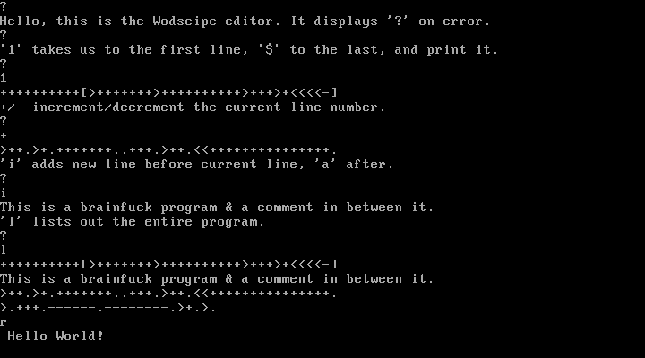

# Wodscipe

Wodscipe, a 512-byte IDE, is intended to revolutionalize how IDEs behave and
work. The project has a built-in `ed` clone, one of the best in field. It
also boasts support for multiple languages (like brainfuck, ...), and is
extendable like a charm.

## Why?

[We were building our own fucking birdfeeder.](http://natashenka.ca/pocorgtfo02.pdf)

## Testing It Out

### Building It Yourself

The build system only supports *nix hosts, and as such hasn't been tested
elsewhere. After cloning the repository, you can run:

    make

The Makefile variable `PROGLANG` is used to determine which
interpreter to assemble with support for. Supported languages are described
below.

By default, Wodscipe assembles with a demonstrative RPN calculator.

After performing the above operation, you'll obtain a floppy disk image, 
`wodscipe.img`, in the build directory.

### Pre-built Images

Pre-built images can be obtained from the Releases section, on the GitHub
repository.

### Running

The floppy image works with all major emulators, and any 1.44MiB floppy disk.
As an example, `qemu-system-i386 -fda wodscipe.img` can be used to test it
via QEMU.

## Usage

Anyone familiar with `ed` wouldn't have much difficulty adapting to Wodscipe.
One notable quirk is that `a` and `i` only input one line at a time.
The program can be run via `r`.

Further documentation for the editor can be found in
[editor.txt](doc/editor.txt), and rest of the IDE in [doc/](doc/).

## Supported Languages

The following languages are supported, with further documentation in
[doc/langs/](doc/langs/):

* [Brainfuck.](http://esolangs.org/wiki/Brainfuck)
* [///.](http://esolangs.org/wiki/Slashes)
* [Deadfish.](http://esolangs.org/wiki/Deadfish)
* [Underload.](http://esolangs.org/wiki/Underload)
* [ResPlicate.](http://esolangs.org/wiki/ResPlicate)

## Extend Your Support

The success of the project heavily depends on your valuable support.

To free all developers from the tyranny of existing IDEs, start by recommending
this one to whomsoever you know. Furthermore, star and fork us on GitHub.

Once you've done that, go a step further and add another language to the
Supported Languages list.

## Authors

nortti (JuEeHa) and shikhin (Shikhin) are the folks behind this project.

All authors hang out in `#offtopia` (FreeNode).
